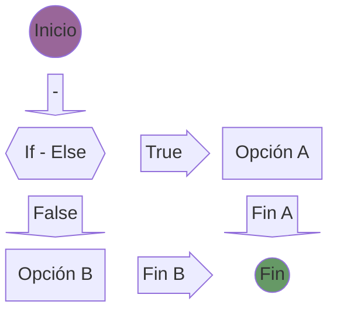
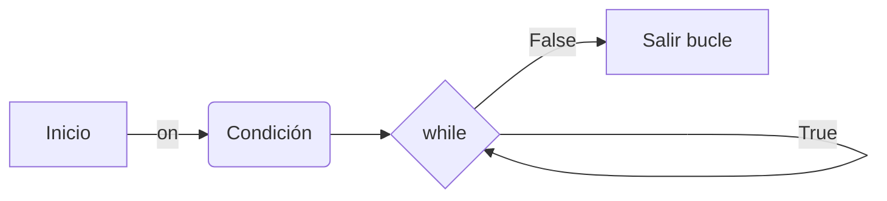

# Programación - Python, Java, C/C++

Programación en los lenguajes: Python, Java, C y C++

- [Programación - Python, Java, C/C++](#programación---python-java-cc)
  - [Python v3](#python-v3)
    - [Variables en Python](#variables-en-python)
    - [Cadenas en Python](#cadenas-en-python)
      - [Métodos de cadena en Python](#métodos-de-cadena-en-python)
      - [Formatos de cadena en Python](#formatos-de-cadena-en-python)
      - [Concatenación de cadenas en Python](#concatenación-de-cadenas-en-python)
      - [Interpolación de cadenas en Python](#interpolación-de-cadenas-en-python)
    - [Entrada de datos por consola en Python](#entrada-de-datos-por-consola-en-python)
    - [Operadores Aritméticos en Python](#operadores-aritméticos-en-python)
    - [Operadores de Asignación en Python](#operadores-de-asignación-en-python)
    - [Operador de Asignación Compuesto en Python](#operador-de-asignación-compuesto-en-python)
    - [Operadores de Comparación en Python](#operadores-de-comparación-en-python)
    - [Sentencia if - else en Python](#sentencia-if---else-en-python)
    - [Operadores lógicos AND, OR y NOT en Python](#operadores-lógicos-and-or-y-not-en-python)
    - [Bucle WHILE en Python](#bucle-while-en-python)
    - [Bucle FOR en Python](#bucle-for-en-python)
    - [Listas, Tuplas, Diccionarios](#listas-tuplas-diccionarios)
      - [Colecciones en Python](#colecciones-en-python)
      - [Listas en Python](#listas-en-python)

## Python v3

**Python 3.12.5** es el intérpetre actualmente instalado en W11. Se requiere instalar PyCharm es un IDE para Python. La versión gratuita es la Community Edition.

Programa de Python:

```python
# Programa Python con intérprete 3.12.5
print('Hola Mundo en Python con intérprete 3.12.5')
```

### Variables en Python

Las variables es un espacio de memoria, donde se almacena información. La manera de definir una variable en Python es: **nombre_variable = valor_asignado**. Se pueden almacenar valores tipo: números _enteros_, números _reales_, _letras_, _palabras_. Los valores dentro del tipo de dato, pueden cambiar.

Las variables en Python:

- Solo pueden empezar por letra o por guion bajo.
- Pueden continuar con letras, números o guion bajo.
- Sensible a mayúsculas y a minúsculas.
- No se pueden utilizar palabras reservadas.
  
```python
# Asignación de valores a variables
mi_entero = 10          # tipo int 
mi_flotante = 5.7       # tipo float
mi_cadena = 'Juan'      # tipo str (string). se puede usar comilla doble o simple 
```

Las buenas prácticas en Python:

- Comenzar con letra en minúsculas.
- Usar notación _snake_case_ (usa guión bajo entre palabras).
- Usar notación _camel case_. Esta opción no es recomendable en Python.
- La notación de Pascal, comineza con una letra en mayúsculas. No es recomendable.

### Cadenas en Python

Las cadenas en Python se encuentran entre comillas simples o dobles. Son inmutables, es decir no pueden cambiar de valor los elementos del array.

```python
# Las cadenas en Python se encuentran entre comillas simples o dobles
mi_cadena = "esta es la cadena de texto"

# salto de línea \n
mi_cadena_con_salto_de_linea = "esta es la cadena de texto\ncon salto de línea"

# Cadena multilinea utilizando triple comillas y tabulación
mi_cadena_multilinea = """
\t\testa es una cadena de texto
con salto de línea
y también puede contener
varias líneas
"""
```

Operaciones con cadenas:

```python
# Concatenación
primer_nombre = "Juan"
apellido = "Perez"

nombre_completo = primer_nombre + " " + apellido

# Repetición
mi_cadena_repetida = mi_cadena * 3

# Indexación
mi_cadena_indexada = "Hola, mundo!"

primera_letra = mi_cadena_indexada[0]
ultima_letra = mi_cadena_indexada[-1]

# Slicing
mi_cadena_slicada = mi_cadena_indexada[0:5]
```

#### Métodos de cadena en Python

```python
# Métodos
mensaje 0 'Hola Mundo'
mi_cadena_minusculas = mensaje.lower() # minúsculas
mi_cadena_mayusculas = mensaje.upper() # mayúsculas
mi_cadena_longitud = len(mensaje)      # longitud
```

#### Formatos de cadena en Python

```python
# Formato de cadenas en Python
    var_hola = 'Hola'
    var_mundo = 'Mundo'

    print(var_hola, var_mundo)
```

#### Concatenación de cadenas en Python

```python
# Concatenación => unir dos o más cadenas en Python 
# Se utiliza el operador +

    var_hola = 'Hola'
    var_mundo = 'Mundo'
    var_concatenada = var_hola + " " + var_Mundo
```

#### Interpolación de cadenas en Python

```python
# Interpolación. Se usa la letra f

    var_hola = 'Hola'
    var_mundo = 'Mundo'
    var_interpolada = f'Mi cadena: {var_hola} {var_mundo}'
```

```python
# Interpolación con triple comillas (simples o dobles)

    var_hola = 'Hola'
    var_mundo = 'Mundo'
    var_interpolada = f'''Mi cadena: 
        {var_hola} 
        {var_mundo} '''
    # Imprime en multilínea. Acepta un formato de tabulación y de salto de línea
```

### Entrada de datos por consola en Python

La entrada de datos por consola en Python utiliza la instrucción `input()`.

```python
    print("Ingrese un mensaje:")
    entrada = input()

    print(f'El dato introducido por consola es: {entrada}')
```

Para que el operador **+** realice la suma y no la concatenación de dos números, se debe convertir el tipo de dato introducido (string) a tipo entero.

```python
# int() -> convierte una cadena a un tipo entero
# float() -> convierte una cadena a un tipo decimal

    numero1 = int(input('Intro el primer número: '))
    numero2 = int(input('Intro el segundo número: '))
    suma = numero1 + numero2    #La conversión a int() se puede realizar aquí

    print(f'El Resultado de {numero1} + {numero2} = {suma}')
```

### Operadores Aritméticos en Python

```python
a,b = 10, 5
suma = a + b
resta = a - b
multiplicacion = a * b
division = a / b    # operador división (devuelve número real float)
modulo = a % b      # operador módulo (resto de la división)
potencia = a ** b   # base: a, exponente: b
```

### Operadores de Asignación en Python

Asignación de un valor primitivo:

```python
a = 5
print(f'El Resultado de {a} + {a} = {a+a}')
```

Asignación múltiple:

```python
a, b, c = 10, "Esto es un string", 14.5
print(f'Valor de {a}, de {b} y de {c}')
```

Asignación de un mismo valor a diferentes variables:

```python
x = y = z = 20
print(f'El valor de {x}, {y} y {z} es 20')
```

### Operador de Asignación Compuesto en Python

El operador compuesto de suma **+=** combina la suma con la asignación. El resultado de la suma se almacena en la misma variable que participa en la operación de suma.

```python
a += b # a = a + b
```

El operador compuesto de de resta **-=** combina la resta con la asignación `a -= b`.  
El operador compuesto de la multiplicación `a *= b`.
El operador compuesto de la división `a /= b`.

### Operadores de Comparación en Python

Realiza comparaciones entre variables. También se conocen como **comparadores relacionales**. Este tipo de comparaciones, retorna valores: **True** o **False**.

```python
a, b = 7, 5
print(f'a == b: {a == b}')  # Igualdad
print(f'a!= b: {a != b}')  # Diferencia
print(f'a < b: {a < b}')  # Menor que
print(f'a <= b: {a <= b}')  # Menor o igual que
print(f'a > b: {a > b}')  # Mayor que
```

### Sentencia if - else en Python



Para revisar más condiciones usamos `if - elif - else`. Se pueden añadir tanto `elif` como se deseen.

```python
decision_a = False
decision_b = True

if decision_a:
    print("La decision es verdadera opción I.")
elif decision_b:
    print("La decision es verdadeda opción II.")
else:
    print("La decision es falsa.")
```

### Operadores lógicos AND, OR y NOT en Python

```tip
Operador AND. El resultado es True si las entradas A y B son True en los caso contrarios son False. (a and b).
```

```warning
Operador OR. El resultado es True si las entradas A o B son True en el caso en que A y B son False el resultado es False. (a or b).
```

```danger
Operador NOT. El resultado es True si la entrada es False o viceversa. (a = not b).
```

### Bucle WHILE en Python

En Python existen los ciclos **while** y los ciclos **for**. En el ciclo **while** existirá una condición que permite entrar al mismo y continuará repitiendo el bucle miestras la condición no cambie a falsa.



```python
i = 0
while i < 5:
    print(f'Valor: {i}')
    i += 1
```

### Bucle FOR en Python

Permite iterar conociendo en número de ciclos. Ejemplo de bucle **for**:

```python
cadena = 'Hola Mundo'
for letra in cadena:
    print(letra, end=' ') # end=' ' imprime sin \n
```

La función `range(valor_inic, valor_fin)` permite un rango de valores desde un inicio hasta un final:

```python
for contador in range(1,5):
    print(f'Rango del 1 al 6: {contador}')
```

### Listas, Tuplas, Diccionarios

#### Colecciones en Python

Permite agrupar varios datos en una misma variable (colección).

1. **Listas**: conjunto de datos ordenados. Se puede modificar el valor de cualquiera de sus elementos, incluso añadir nuevos.
2. **Tuplas**: almacena conjunto de datos de cualquier tipo. Son inmutables, ya que no podemos modificar, añadir o borrar sus elementos.
3. **Set**: no mantienen un orden, ni elementos duplicados como si lo tienen las _Listas_ o las _Tuplas_.
4. **Diccionarios**: almacena la información en formato llave-valor. Los elementos están ordenados y es posible modificar los elementos.

#### Listas en Python

```note
Lists are mutable sequences, typically used to store collections of homogeneous items (where the precise degree of similarity will vary by application).
```

```tip
Lists may be constructed in several ways:

- Using a pair of square brackets to denote the empty list: []
- Using square brackets, separating items with commas: [a], [a, b, c]
- Using a list comprehension: [x for x in iterable]
- Using the type constructor: list() or list(iterable)
```

```python
# Lista compuesta de nombres. El primer elemento empieza por 0
nombres = ['Juan', 'Maria', 'Pedro', 'Ana']
print (f'Lista de nombres: {nombres}')

# Lista heterogénea (múltiples tipos de datos)
lista_hetero = [10, True, 'Antonio']
print (f'Lista de lista: {lista_hetero}')
```
