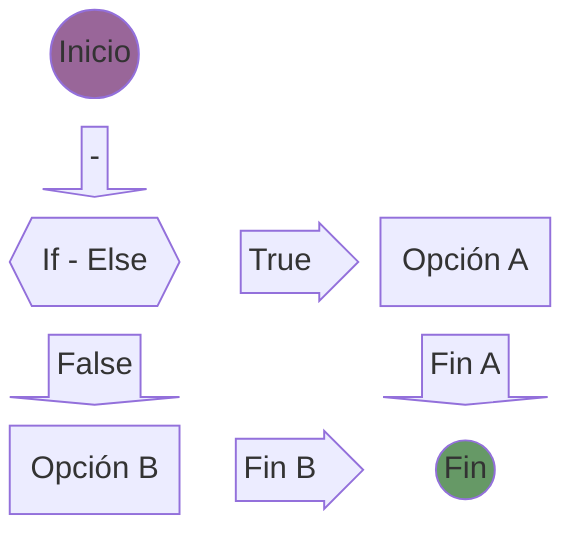
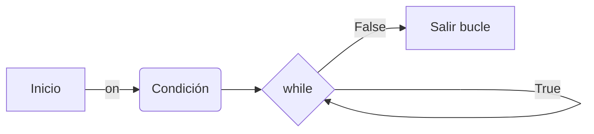
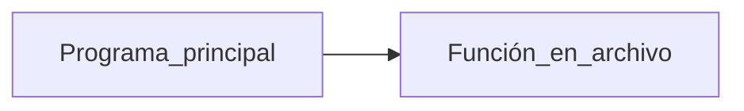

# Programación - Python, Java, C/C++

Programación en los lenguajes: Python, Java, C y C++

- [Programación - Python, Java, C/C++](#programación---python-java-cc)
  - [Python v3](#python-v3)
    - [Variables en Python](#variables-en-python)
    - [Cadenas en Python](#cadenas-en-python)
      - [Métodos de cadena en Python](#métodos-de-cadena-en-python)
      - [Formatos de cadena en Python](#formatos-de-cadena-en-python)
      - [Concatenación de cadenas en Python](#concatenación-de-cadenas-en-python)
      - [Interpolación de cadenas en Python](#interpolación-de-cadenas-en-python)
    - [Entrada de datos por consola en Python](#entrada-de-datos-por-consola-en-python)
    - [Operadores Aritméticos en Python](#operadores-aritméticos-en-python)
    - [Operadores de Asignación en Python](#operadores-de-asignación-en-python)
    - [Operador de Asignación Compuesto en Python](#operador-de-asignación-compuesto-en-python)
    - [Operadores de Comparación en Python](#operadores-de-comparación-en-python)
    - [Sentencia if - else en Python](#sentencia-if---else-en-python)
    - [Operadores lógicos AND, OR y NOT en Python](#operadores-lógicos-and-or-y-not-en-python)
    - [Bucle WHILE en Python](#bucle-while-en-python)
    - [Bucle FOR en Python](#bucle-for-en-python)
    - [Listas, Tuplas, Diccionarios](#listas-tuplas-diccionarios)
      - [Colecciones en Python](#colecciones-en-python)
      - [Listas en Python](#listas-en-python)
      - [Tuplas en Python](#tuplas-en-python)
      - [Set en Python](#set-en-python)
      - [Diccionario en Python](#diccionario-en-python)
      - [Listas \& Diccionarios en Python](#listas--diccionarios-en-python)
    - [Funciones en Python](#funciones-en-python)
      - [Parámetros y Argumentos en funciones de Python](#parámetros-y-argumentos-en-funciones-de-python)
      - [Módulos en Python](#módulos-en-python)
      - [Argumentos por nombre en funciones de Python](#argumentos-por-nombre-en-funciones-de-python)
      - [Retornar Tuplas desde una función en Python](#retornar-tuplas-desde-una-función-en-python)
      - [Argumentos variables en una función de Python](#argumentos-variables-en-una-función-de-python)

## Python v3

**Python 3.12.5** es el intérpetre actualmente instalado en W11. Se requiere instalar PyCharm es un IDE para Python. La versión gratuita es la Community Edition.

Programa de Python:

```python
# Programa Python con intérprete 3.12.5
print('Hola Mundo en Python con intérprete 3.12.5')
```

### Variables en Python

Las variables es un espacio de memoria, donde se almacena información. La manera de definir una variable en Python es: **nombre_variable = valor_asignado**. Se pueden almacenar valores tipo: números _enteros_, números _reales_, _letras_, _palabras_. Los valores dentro del tipo de dato, pueden cambiar.

Las variables en Python:

- Solo pueden empezar por letra o por guion bajo.
- Pueden continuar con letras, números o guion bajo.
- Sensible a mayúsculas y a minúsculas.
- No se pueden utilizar palabras reservadas.
  
```python
# Asignación de valores a variables
mi_entero = 10          # tipo int 
mi_flotante = 5.7       # tipo float
mi_cadena = 'Juan'      # tipo str (string). se puede usar comilla doble o simple 
```

Las buenas prácticas en Python:

- Comenzar con letra en minúsculas.
- Usar notación _snake_case_ (usa guión bajo entre palabras).
- Usar notación _camel case_. Esta opción no es recomendable en Python.
- La notación de Pascal, comineza con una letra en mayúsculas. No es recomendable.

### Cadenas en Python

Las cadenas en Python se encuentran entre comillas simples o dobles. Son inmutables, es decir no pueden cambiar de valor los elementos del array.

```python
# Las cadenas en Python se encuentran entre comillas simples o dobles
mi_cadena = "esta es la cadena de texto"

# salto de línea \n
mi_cadena_con_salto_de_linea = "esta es la cadena de texto\ncon salto de línea"

# Cadena multilinea utilizando triple comillas y tabulación
mi_cadena_multilinea = """
\t\testa es una cadena de texto
con salto de línea
y también puede contener
varias líneas
"""
```

Operaciones con cadenas:

```python
# Concatenación
primer_nombre = "Juan"
apellido = "Perez"

nombre_completo = primer_nombre + " " + apellido

# Repetición
mi_cadena_repetida = mi_cadena * 3

# Indexación
mi_cadena_indexada = "Hola, mundo!"

primera_letra = mi_cadena_indexada[0]
ultima_letra = mi_cadena_indexada[-1]

# Slicing
mi_cadena_slicada = mi_cadena_indexada[0:5]
```

#### Métodos de cadena en Python

```python
# Métodos
mensaje 0 'Hola Mundo'
mi_cadena_minusculas = mensaje.lower() # minúsculas
mi_cadena_mayusculas = mensaje.upper() # mayúsculas
mi_cadena_longitud = len(mensaje)      # longitud
```

#### Formatos de cadena en Python

```python
# Formato de cadenas en Python
    var_hola = 'Hola'
    var_mundo = 'Mundo'

    print(var_hola, var_mundo)
```

#### Concatenación de cadenas en Python

```python
# Concatenación => unir dos o más cadenas en Python 
# Se utiliza el operador +

    var_hola = 'Hola'
    var_mundo = 'Mundo'
    var_concatenada = var_hola + " " + var_Mundo
```

#### Interpolación de cadenas en Python

```python
# Interpolación. Se usa la letra f

    var_hola = 'Hola'
    var_mundo = 'Mundo'
    var_interpolada = f'Mi cadena: {var_hola} {var_mundo}'
```

```python
# Interpolación con triple comillas (simples o dobles)

    var_hola = 'Hola'
    var_mundo = 'Mundo'
    var_interpolada = f'''Mi cadena: 
        {var_hola} 
        {var_mundo} '''
    # Imprime en multilínea. Acepta un formato de tabulación y de salto de línea
```

### Entrada de datos por consola en Python

La entrada de datos por consola en Python utiliza la instrucción `input()`.

```python
    print("Ingrese un mensaje:")
    entrada = input()

    print(f'El dato introducido por consola es: {entrada}')
```

Para que el operador **+** realice la suma y no la concatenación de dos números, se debe convertir el tipo de dato introducido (string) a tipo entero.

```python
# int() -> convierte una cadena a un tipo entero
# float() -> convierte una cadena a un tipo decimal

    numero1 = int(input('Intro el primer número: '))
    numero2 = int(input('Intro el segundo número: '))
    suma = numero1 + numero2    #La conversión a int() se puede realizar aquí

    print(f'El Resultado de {numero1} + {numero2} = {suma}')
```

### Operadores Aritméticos en Python

```python
a,b = 10, 5
suma = a + b
resta = a - b
multiplicacion = a * b
division = a / b    # operador división (devuelve número real float)
modulo = a % b      # operador módulo (resto de la división)
potencia = a ** b   # base: a, exponente: b
```

### Operadores de Asignación en Python

Asignación de un valor primitivo:

```python
a = 5
print(f'El Resultado de {a} + {a} = {a+a}')
```

Asignación múltiple:

```python
a, b, c = 10, "Esto es un string", 14.5
print(f'Valor de {a}, de {b} y de {c}')
```

Asignación de un mismo valor a diferentes variables:

```python
x = y = z = 20
print(f'El valor de {x}, {y} y {z} es 20')
```

### Operador de Asignación Compuesto en Python

El operador compuesto de suma **+=** combina la suma con la asignación. El resultado de la suma se almacena en la misma variable que participa en la operación de suma.

```python
a += b # a = a + b
```

El operador compuesto de de resta **-=** combina la resta con la asignación `a -= b`.  
El operador compuesto de la multiplicación `a *= b`.
El operador compuesto de la división `a /= b`.

### Operadores de Comparación en Python

Realiza comparaciones entre variables. También se conocen como **comparadores relacionales**. Este tipo de comparaciones, retorna valores: **True** o **False**.

```python
a, b = 7, 5
print(f'a == b: {a == b}')  # Igualdad
print(f'a!= b: {a != b}')  # Diferencia
print(f'a < b: {a < b}')  # Menor que
print(f'a <= b: {a <= b}')  # Menor o igual que
print(f'a > b: {a > b}')  # Mayor que
```

### Sentencia if - else en Python



Para revisar más condiciones usamos `if - elif - else`. Se pueden añadir tanto `elif` como se deseen.

```python
decision_a = False
decision_b = True

if decision_a:
    print("La decision es verdadera opción I.")
elif decision_b:
    print("La decision es verdadeda opción II.")
else:
    print("La decision es falsa.")
```

### Operadores lógicos AND, OR y NOT en Python

```tip
Operador AND. El resultado es True si las entradas A y B son True en los caso contrarios son False. (a and b).
```

```warning
Operador OR. El resultado es True si las entradas A o B son True en el caso en que A y B son False el resultado es False. (a or b).
```

```danger
Operador NOT. El resultado es True si la entrada es False o viceversa. (a = not b).
```

### Bucle WHILE en Python

En Python existen los ciclos **while** y los ciclos **for**. En el ciclo **while** existirá una condición que permite entrar al mismo y continuará repitiendo el bucle miestras la condición no cambie a falsa.



```python
i = 0
while i < 5:
    print(f'Valor: {i}')
    i += 1
```

### Bucle FOR en Python

Permite iterar conociendo en número de ciclos. Ejemplo de bucle **for**:

```python
cadena = 'Hola Mundo'
for letra in cadena:
    print(letra, end=' ') # end=' ' imprime sin \n
```

La función `range(valor_inic, valor_fin)` permite un rango de valores desde un inicio hasta un final:

```python
for contador in range(1,5):
    print(f'Rango del 1 al 6: {contador}')
```

### Listas, Tuplas, Diccionarios

#### Colecciones en Python

Permite agrupar varios datos en una misma variable (colección).

1. **Listas**: conjunto de datos ordenados. Se puede modificar el valor de cualquiera de sus elementos, incluso añadir nuevos.
2. **Tuplas**: almacena conjunto de datos de cualquier tipo. Son inmutables, ya que no podemos modificar, añadir o borrar sus elementos.
3. **Set**: no mantienen un orden, ni elementos duplicados como si lo tienen las _Listas_ o las _Tuplas_.
4. **Diccionarios**: almacena la información en formato llave-valor. Los elementos están ordenados y es posible modificar los elementos.

#### Listas en Python

```note
Lists are mutable sequences, typically used to store collections of homogeneous items (where the precise degree of similarity will vary by application).
```

```tip
Lists may be constructed in several ways:

- Using a pair of square brackets to denote the empty list: []
- Using square brackets, separating items with commas: [a], [a, b, c]
- Using a list comprehension: [x for x in iterable]
- Using the type constructor: list() or list(iterable)
```

```python
# Lista compuesta de nombres. El primer elemento empieza por 0
nombres = ['Juan', 'Maria', 'Pedro', 'Ana']
print (f'Lista de nombres: {nombres}')

# Lista heterogénea (múltiples tipos de datos)
lista_hetero = [10, True, 'Antonio']
print (f'Lista de lista: {lista_hetero}')
```

#### Tuplas en Python

```note
Tuples are immutable sequences, typically used to store collections of heterogeneous data (such as the 2-tuples produced by the enumerate() built-in). Tuples are also used for cases where an immutable sequence of homogeneous data is needed (such as allowing storage in a set or dict instance).
```

```tip
class tuple([iterable])

Tuples may be constructed in a number of ways:

- Using a pair of parentheses to denote the empty tuple: ()
- Using a trailing comma for a singleton tuple: a, or (a,)
- Separating items with commas: a, b, c or (a, b, c)
- Using the tuple() built-in: tuple() or tuple(iterable)
```

Ejemplo de creación de **tupla** inmutable:

```python
# tupla de nombres
nombres = ('Juan', 'Pedro', 'Maria', 'Isabel')
print(f'Tupla inmutable de nombres: {nombres}')

# tupla heterogénea
heterogenea = (10, 'Hola', True, [1, 2, 3])
print(f'Tupla heterogénea: {heterogenea}')
```

#### Set en Python

Los **SET** y los **Conjuntos son equivalentes, en Python.

```note
A set object is an unordered collection of distinct hashable objects. Common uses include membership testing, removing duplicates from a sequence, and computing mathematical operations such as intersection, union, difference, and symmetric difference. (For other containers see the built-in dict, list, and tuple classes, and the collections module.)
```

```tip
class set([iterable])
class frozenset([iterable])

Return a new set or frozenset object whose elements are taken from iterable. The elements of a set must be hashable. To represent sets of sets, the inner sets must be frozenset objects. If iterable is not specified, a new empty set is returned.

Sets can be created by several means:
- Use a comma-separated list of elements within braces: {'jack', 'sjoerd'}
- Use a set comprehension: {c for c in 'abracadabra' if c not in 'abc'}
- Use the type constructor: set(), set('foobar'), set(['a', 'b', 'foo'])
```

Ejemplo de creación de un **Set** de datos no repetidos sin orden en particular:

```python
# Creación de un Set vacío
s = set()

# Añadir elementos al Set
s.add(1)
s.add(2)
s.add(3)

# Mostrar el Set
print(s)
```

#### Diccionario en Python

Un **diccionario** puede tener cantidad de elementos, en forma: **clave:valor** (_key:value_). En los **diccionarios** se utilizan llaves **{}** (como en el _set_). La **clave** (_key_) debe ser de tipo _string_, el **valor** si que puede ser de cualquier otro tipo. A partir de la versión 3.7 los datos si están ordenados. No se permite duplicar elementos dentro de un **diccionario**, en caso de duplicidad, el último valor introducido es el que predominará.

```tip
Dictionaries can be created by several means:

- Use a comma-separated list of key: value pairs within braces: {'jack': 4098, 'sjoerd': 4127} or {4098: 'jack', 4127: 'sjoerd'}
- Use a dict comprehension: {}, {x: x ** 2 for x in range(10)}
- Use the type constructor: dict(), dict([('foo', 100), ('bar', 200)]), dict(foo=100, bar=200)
```

```python
# Diccionario vacío
diccionario = {}

# Diccionario con pares clave-valor
diccionario = {
    'clave1': 'valor1',
    'clave2': 'valor2',
    'clave3': 'valor3'
}

# Añadir un par clave-valor
diccionario['clave4'] = 'valor4'

# Modificar un valor
diccionario['clave1'] = 'nuevo_valor1'

# Eliminar un par clave-valor
del diccionario['clave2']
```

Las llaves del **diccionario** se imprimen entre _corchetes_:

```python
# Obtener una lista de las llaves de nuestro diccionario

diccionario = {'a': 1, 'b': 2, 'c': 3}
llaves = list(diccionario.keys())
print(llaves)   # ['a', 'b', 'c']
# Obtener una lista de los valores de nuestro diccionario
print(f'Lista valores: {diccionario.values()}')
# Obtener una lista de los elementos del diccionario (items)
print(f'Lista elementos: {diccionario.items()}')
```

#### Listas & Diccionarios en Python

Un elemento de la **lista** puede ser un **objeto**, un **diccionario** u otro tipo. Son útiles para almacenar información.

```python
# Diccionario 1
diccionario_1 = {
    "nombre": "Juan",
    "apellido": "Pérez",
    "edad": 25,
    "direccion": {
        "calle": "Av. Paseo de la Reina",
        "numero": 123,
        "ciudad": "Barcelona"
    }
}

# Diccionario 2
diccionario_2 = {
    "nombre": "Maria",
    "apellido": "García",
    "edad": 30,
    "direccion": {
        "calle": "Calle del Prado",
        "numero": 456,
        "ciudad": "Madrid"
    }
}

# Añadir los diccionarios a la lista
lista_de_diccionarios = [diccionario_1, diccionario_2]
```

### Funciones en Python

Con las **funciones** podemos tener el código en distintos módulos, se crea modularidad. En Python se define la función de la siguiente forma: `def nombre_función([parámetros]): código [return]`.

```python
# Crear una función
def mi_funcion():
    print("Hola, soy una función en Python.")
    print("Esta función no tiene parámetros.")

# Llamar a la función
mi_funcion()
```

#### Parámetros y Argumentos en funciones de Python

```python
# Función que recibe parámetros y los imprime
def saludar(parametro):
    print(f'Mensaje recibido por parámetros: {parametro}')
# Llamada a la función
saludar('Hola Mundo')
saludar('Adios')
```

#### Módulos en Python

Cuando definimos una función en un archivo diferente al archivo del programa principal.



Ejemplo de programa principal, que enlaza con función definida en otro archivo:

```python
from moduloFunc import saludar
# Programa Principal
argumento = input('Mensaje a enviar: ')
valor_devuelto = saludar(argumento)
print(f'Valor devuelto de la función: {valor_devuelto}')
```

```python
# Función con parámetros en archivo moduloFunc.py
def saludar(parametros):
    print(f'Mensaje recibido: {parametros}')
    return 'Termina función OK'
```

#### Argumentos por nombre en funciones de Python

```python
# Función con argumentos en Python
def greet_user(name, apellido='', age=0):
    print(f"Hello {name} and {apellido}! You are {age} years old.")

## Llamar a la función
greet_user("John Doe", 30)  # opción 1
greet_user(name='Anto') # opción 2
```

#### Retornar Tuplas desde una función en Python

```python
# definir la función que recibe parámetros y retorna una tupla
def persona_mayuscula(nombre, apellido, edad):
    print("Esta función retorna valores (tupla)")
    return (nombre.upper(), apellido.upper(), edad)

# Programa principal
nombre, apellido, edad = persona_mayuscula('Sandra','Jiménez', 43)
print(f'Persona: nombre = {nombre}, apellido = {apellido}, edad = {edad}')
```

#### Argumentos variables en una función de Python

Los argumentos variables se envían en forma de **Tupla**.

```python
# Crear una función que reciba argumentos variables
def suma_variables(*args):
    # Recorrer los argumentos y sumarlos
    return sum(args)

# Utilizar la función con diferentes argumentos
print(suma_variables(1, 2, 3, 4, 5))  # Imprime: 15
print(suma_variables(10, 20, 30))  # Imprime: 60
print(suma_variables(5, 10, 15, 20))  # Imprime: 50
```

Ejemplo de argumento variable combinado con un argumento fijo:

```python
def mi_funcion(nombre, *args):
    print(f"Hola {nombre}! Mi suma es: {suma_variables(*args)}")

mi_funcion("Juan", 1, 2, 3, 4, 5)  # Imprime: Hola Juan! Mi suma es: 15
```

Argumentos variables enviados en forma de **Diccionarios**, para ello se utiliza `**kwargs` en los argumentos.

1. **args -> arguments -> tupla.
2. **kwargs -> keyword arguments -> diccionario.
3. En una función que combine el uso de valores: _fijos_, _\*\*args_ y _\*\*keywards_, se deben colocar en el orden indicado.
